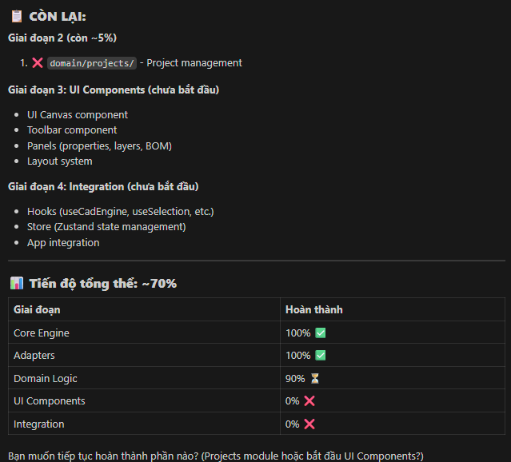
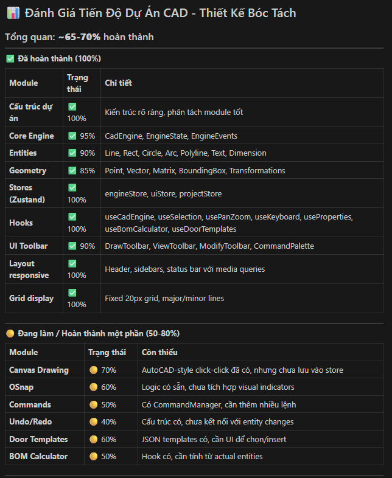

================================================================================
📋 FILE GHI CHÚ CẤU TRÚC DỰ ÁN - KHÔNG PHẢI CODE
================================================================================
Mục đích: Ghi lại sơ đồ cấu trúc thư mục để dễ tìm file sau này
Tác giả: [Tên bạn]
Ngày tạo: [Ngày tạo]
================================================================================

CẤU TRÚC THƯ MỤC WEB CAD – FULL & CLEAN
vừa là WEB CAD – FULL & CLEAN, vừa có luôn phần bóc tách khối lượng (nhôm, kính, phụ kiện, báo giá) và lưu trữ rõ ràng.

src/
│
├─ core/                           # 🧠 LÕI CAD (TypeScript tĩnh, không phụ thuộc ALUBOK)
│  │
│  ├─ engine/                      # Điều phối trung tâm CAD
│  │  ├─ CadEngine.ts             # Interface + implementation core
│  │  ├─ EngineState.ts           # Kiểu trạng thái engine
│  │  └─ EngineEvents.ts          # Sự kiện nội bộ (entityAdded, commandDone...)
│  │
│  ├─ document/                    # Dữ liệu bản vẽ thuần CAD
│  │  ├─ CadDocument.ts           # Doc, layer, viewport...
│  │  ├─ Layer.ts
│  │  ├─ Block.ts                 # Block / symbol
│  │  └─ History.ts               # Undo / Redo
│  │
│  ├─ entities/                    # ĐỐI TƯỢNG (mỗi entity 1 ID riêng)
│  │  ├─ BaseEntity.ts
│  │  ├─ Line.ts
│  │  ├─ Polyline.ts
│  │  ├─ Rect.ts
│  │  ├─ Circle.ts
│  │  ├─ Arc.ts
│  │  ├─ Text.ts
│  │  ├─ Dimension.ts
│  │  └─ Entity.types.ts
│  │
│  ├─ commands/                    # LỆNH (State Machine AutoCAD-style)
│  │  ├─ CommandManager.ts
│  │  ├─ CommandContext.ts
│  │  ├─ Command.types.ts
│  │  │
│  │  ├─ draw/                    # LINE, RECT, CIRCLE…
│  │  ├─ modify/                  # MOVE, ROTATE, OFFSET, TRIM, EXTEND…
│  │  ├─ dimension/               # DIM LINEAR, ALIGNED…
│  │  └─ view/                    # PAN, ZOOM, ZOOM EXTENTS…
│  │
│  ├─ geometry/                    # Toán – Hình học / ma trận
│  │  ├─ Vec2.ts
│  │  ├─ Matrix3.ts
│  │  ├─ Transform2D.ts
│  │  └─ GeometryUtils.ts
│  │
│  ├─ properties/                  # BẢNG THUỘC TÍNH (edit theo ID)
│  │  ├─ PropertySchema.ts        # Định nghĩa schema cho từng loại entity
│  │  └─ PropertyApplier.ts       # Apply: màu, lineType, kích thước, text...
│  │
│  ├─ osnap/                       # Bắt điểm (END, MID, CENTER…)
│  │  ├─ OsnapManager.ts
│  │  └─ Osnap.types.ts
│  │
│  ├─ constraints/                 # Ràng buộc hình học (tùy chọn)
│  │  ├─ Constraint.types.ts
│  │  └─ ConstraintSolver.ts
│  │
│  └─ export/                      # Xuất bản vẽ
│     ├─ Export.types.ts
│     ├─ ExportJSON.ts
│     ├─ ExportPNG.ts
│     ├─ ExportPDF.ts
│     └─ ExportDXF.ts
│
├─ domain/                         # 🧱 NGHIỆP VỤ ALUBOK (nhôm, kính, bóc tách)
│  │
│  ├─ materials/                   # Thư viện vật tư
│  │  ├─ Material.types.ts        # Kiểu vật liệu chung
│  │  ├─ ProfileCatalog.ts        # Danh mục thanh nhôm (mã cây, trọng lượng/m)
│  │  ├─ GlassCatalog.ts          # Kính (độ dày, trọng lượng/m2)
│  │  └─ AccessoryCatalog.ts      # Phụ kiện (bản lề, khóa, vít…)
│  │
│  ├─ door/                        # MÔ HÌNH CỬA (từ CAD → cửa)
│  │  ├─ DoorModel.ts             # Cửa = khung + cánh + ô kính (parametric)
│  │  ├─ DoorTemplate.ts          # Mẫu cửa kéo thả (1 cánh, 2 cánh, trượt…)
│  │  └─ DoorParametrics.ts       # Quy tắc sinh hình từ kích thước
│  │
│  ├─ bom/                         # BÓC TÁCH – KHỐI LƯỢNG – BÁO GIÁ
│  │  ├─ BomItem.ts               # Dòng vật tư (nhôm, kính, phụ kiện)
│  │  ├─ BomCalculator.ts         # Tính khối lượng từ DoorModel + entities
│  │  ├─ CutListOptimizer.ts      # Tối ưu cắt cây nhôm (bin packing)
│  │  ├─ GlassCutCalculator.ts    # Tính tấm kính cắt, diện tích
│  │  ├─ QuoteCalculator.ts       # Ra bảng giá (vật tư + công + %)
│  │  └─ ReportGenerator.ts       # Xuất báo cáo: PDF/Excel
│  │
│  ├─ projects/                    # Dự án / công trình / khách hàng
│  │  ├─ Project.types.ts
│  │  ├─ ProjectRepository.ts     # CRUD project (local/remote)
│  │  └─ ProjectService.ts        # Ghép: bản vẽ + BOM + báo giá
│  │
│  └─ rules/                       # Quy tắc nghiệp vụ
│     ├─ PricingRules.ts          # Quy tắc giá (theo m2, theo bộ, chiết khấu)
│     └─ BuildingRules.ts         # Quy chuẩn tối thiểu (dày kính, tải trọng…)
│
├─ app/                            # 🎛️ ĐIỀU PHỐI ỨNG DỤNG
│  │
│  ├─ config/                      # Cấu hình động (type-safe)
│  │  ├─ toolbar.config.ts        # Nhóm Draw/Modify/Dim/Osnap/Optional/File
│  │  ├─ shortcuts.config.ts      # Phím tắt (L, TR, Z, CTRL+Z…)
│  │  └─ osnap.config.ts          # Mặc định bật END, MID, CENTER…
│  │
│  ├─ registry/                    # Đăng ký lệnh & tool
│  │  ├─ CommandRegistry.ts
│  │  └─ ToolRegistry.ts
│  │
│  ├─ events/                      # EventBus toàn app
│  │  ├─ EventBus.ts
│  │  └─ AppEvents.ts
│  │
│  ├─ plugins/                     # Plugin hệ thống (mở rộng sau này)
│  │  ├─ PluginManager.ts
│  │  ├─ Plugin.types.ts
│  │  └─ builtin/
│  │
│  └─ services/                    # Dịch vụ dùng chung
│     ├─ StorageService.ts        # API cao cấp: save/load doc, project
│     ├─ ExportService.ts         # Gọi core/export + domain/bom/report
│     └─ LoggingService.ts        # Log, telemetry
│
├─ adapters/                       # 🔌 KẾT NỐI MÔI TRƯỜNG (UI/hạ tầng)
│  │
│  ├─ canvas/                      # Rendering layer
│  │  ├─ CanvasAdapter.ts         # Interface chung
│  │  ├─ FabricAdapter.ts         # Triển khai bằng Fabric.js
│  │  └─ SvgAdapter.ts            # Triển khai bằng SVG
│  │
│  ├─ persistence/                 # LƯU TRỮ THỰC TẾ (trả lời câu “lưu ở đâu?”)
│  │  ├─ LocalStorageAdapter.ts   # Lưu trong localStorage/IndexedDB
│  │  ├─ FileSystemAdapter.ts     # Xuất/đọc file .alubok, .json, .dxf…
│  │  └─ RemoteStorageAdapter.ts  # REST/Firebase/Firestore (cloud)
│  │
│  └─ input/                       # Chuột / bàn phím
│     ├─ MouseAdapter.ts
│     └─ KeyboardAdapter.ts
│
├─ scripting/                      # ⚡ NGÔN NGỮ ĐỘNG / MACRO
│  │
│  ├─ ScriptEngine.ts             # Chạy script giao tiếp với CadEngine + domain
│  ├─ ScriptContext.ts
│  ├─ Script.types.ts
│  │
│  └─ languages/
│     ├─ dsl/                     # DSL CAD riêng (LINE 0,0 100,0…)
│     └─ js/                      # JS macro (nếu cần)
│
├─ store/                          # 🧾 STATE APP (Zustand / Redux…)
│  ├─ engineStore.ts              # Trạng thái CAD (doc, command, osnap…)
│  ├─ uiStore.ts                  # UI: panel nào mở, theme…
│  └─ projectStore.ts             # Project hiện tại, BOM hiện tại, báo giá
│
├─ hooks/                          # 🔗 React ⇄ Engine ⇄ Domain
│  ├─ useCadEngine.ts
│  ├─ usePanZoom.ts
│  ├─ useSelection.ts
│  ├─ useKeyboard.ts
│  ├─ useProperties.ts            # Bảng thuộc tính (id → schema → edit)
│  ├─ useBomCalculator.ts         # Từ doc/project → tính BOM
│  └─ useDoorTemplates.ts         # Kéo thả mẫu cửa
│
├─ ui/                             # 🎨 GIAO DIỆN
│  │
│  ├─ layout/                     # HEAD1/2/3, LEFT, CENTER, RIGHT
│  ├─ canvas/                     # View CAD + HUD, osnap marker…
│  ├─ toolbar/                    # Draw/Modify/Dim/Osnap/Optional/File
│  ├─ panels/
│  │  ├─ PropertiesPanel.tsx      # Bảng thuộc tính entity (mỗi entity 1 ID)
│  │  ├─ LayersPanel.tsx
│  │  ├─ DoorLibraryPanel.tsx     # Thư viện mẫu cửa kéo thả
│  │  ├─ BomPanel.tsx             # Hiển thị khối lượng nhôm, kính, phụ kiện
│  │  ├─ QuotePanel.tsx           # Bảng giá, tổng hợp đơn
│  │  └─ ProjectPanel.tsx         # Danh sách dự án
│  └─ components/                 # Input, ColorPicker, Table, Dialog…
│
├─ scripts/                        # 📄 DỮ LIỆU MẪU / CẤU HÌNH
│  ├─ defaultScene.json           # Bản vẽ mẫu
│  ├─ doorTemplates.json          # Mẫu cửa (1 cánh, 2 cánh, 4 cánh…)
│  └─ priceConfig.json            # Bảng giá cơ bản
│
├─ assets/                         # Ảnh, icon, font…
│
├─ types/                          # Kiểu dùng chung
│  ├─ UUID.ts
│  ├─ Color.ts
│  └─ Index.ts
│
├─ tests/                          # ✅ Test (unit/integration/e2e)
│
└─ docs/                           # 📘 Tài liệu, sơ đồ kiến trúc, ADR

SƠ ĐỒ KIẾN TRÚC WEB CAD + BÓC TÁCH (FINAL)
┌────────────────────────────────────────────┐
│                    UI                      │
│  • Layout / Toolbar / Panels               │
│  • Canvas View (vẽ, kéo thả)               │
│  • Door Properties / Bóc tách              │
└───────────────▲───────────────▲────────────┘
                │ hooks          │ store
┌───────────────┴───────────────┴────────────┐
│          APP STATE & CONTROLLERS             │
│  • UI State (tool, selection)               │
│  • Command / Tool Registry                  │
│  • Plugin Manager                           │
│  • EventBus                                 │
│  • Storage / Export Service                 │
└───────────────▲───────────────▲────────────┘
                │ API           │ typed events
┌───────────────┴───────────────┴────────────┐
│               CORE CAD ENGINE                │
│  • Document / Layer / Entity (ID)           │
│  • Geometry / Transform / Matrix            │
│  • Commands (Draw / Modify / View)          │
│  • Properties (size, color, style…)         │
│  • Osnap / Selection                        │
│  • History (Undo / Redo)                    │
│  • Constraints (Parametric hình học)        │
└───────────────▲───────────────▲────────────┘
                │ refs geometry │
┌───────────────┴───────────────┴────────────┐
│         ASSEMBLY & MATERIAL LOGIC            │
│  • DoorAssembly (1 bộ cửa)                  │
│  • Frame / Leaf / Mullion Rules             │
│  • Material binding (nhôm, kính…)           │
│  • Parametric theo kích thước CAD           │
└───────────────▲───────────────▲────────────┘
                │ calculated   │ rules
┌───────────────┴───────────────┴────────────┐
│          QTO / BÓC TÁCH KHỐI LƯỢNG           │
│  • AluminumCalculator (mét nhôm)            │
│  • GlassCalculator (m² kính)                │
│  • AccessoryCalculator                      │
│  • Waste / Allowance rules (%)              │
└───────────────▲───────────────▲────────────┘
                │ results      │
┌───────────────┴───────────────┴────────────┐
│        STORAGE / EXPORT / INTEGRATION        │
│  • Save project (Local / Cloud)             │
│  • Export BOM / Excel / PDF                 │
│  • Báo giá / ERP / Kho                      │
└────────────────────────────────────────────┘

================================================================================
📋 KẾT THÚC FILE GHI CHÚ
================================================================================

🎯 Đề xuất thứ tự hoàn thiện:
            Giai đoạn 1: Core Engine (Ưu tiên cao nhất)
Đây là "trái tim" của ứng dụng CAD:

1. core/geometry/ - Các phép tính hình học (Point, Line, Rectangle, Vector)
2. core/entities/ - Các đối tượng vẽ (Shape, Door, Window, Frame)
3. core/engine/ - Engine render và xử lý canvas
4. core/commands/ - Undo/Redo, Draw, Select, Move, Delete
          Giai đoạn 2: Domain Logic (Nghiệp vụ)
Xử lý logic ngành cửa nhôm/kính:

5. domain/door/ - Template cửa, cấu trúc cửa
6. domain/materials/ - Vật liệu (nhôm, kính, phụ kiện)
7. domain/bom/ - Bóc tách khối lượng (BOM Calculator)
8. domain/rules/ - Quy tắc thiết kế (kích thước tối đa/tối thiểu)

          Giai đoạn 3: UI Components
Giao diện người dùng:

9. ui/canvas/ - Canvas component hoàn chỉnh
10. ui/toolbar/ - Thanh công cụ vẽ
11. ui/panels/ - Panel thuộc tính, layer, BOM
           Giai đoạn 4: Integrations
Kết nối các phần:

12. adapters/ - Canvas adapter (Fabric.js), lưu trữ
13. hooks/ - React hooks kết nối store với UI
14. store/ - State management (Zustand)
      💡 Khuyến nghị của tôi:
Bắt đầu từ core/geometry/ và core/entities/ vì:

Đây là nền tảng cho mọi thứ khác
Không phụ thuộc vào UI
Dễ viết unit test
Sau khi có core vững chắc, các phần khác sẽ dễ triển khai hơn
